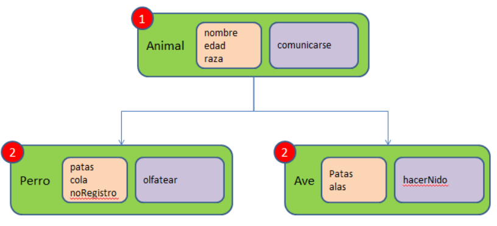

# **El paradigma de la Programacion Orientada a objetos**

## **Paradigma en el contexto de Lenguajes de Progrmacion**
En el contexto de lenguajes de programación, un paradigma se refiere a un conjunto de principios y prácticas que definen la forma en que se escribe el código de un programa. Un paradigma de programación establece cómo se organizan y manipulan los datos, cómo se controla el flujo del programa y cómo se estructuran y organizan las instrucciones.

Existen varios paradigmas de programación, como la programación orientada a objetos, la programación funcional y la programación estructurada. Cada paradigma tiene sus propias reglas y técnicas, y algunos son más adecuados para ciertos tipos de aplicaciones que otros.

Por ejemplo, en la programación orientada a objetos, se enfoca en la creación de objetos que tienen propiedades y métodos, y se utilizan para modelar objetos del mundo real en el software. En la programación funcional, se enfoca en la creación de funciones que transforman los datos de entrada en datos de salida sin modificar los datos originales. En la programación estructurada, se enfoca en la división del código en estructuras de control como bucles y condicionales para controlar el flujo del programa.

## **Definicion de Programacion Orientada a Objetos**
La programación orientada a objetos (POO) es un paradigma de programación que se enfoca en la creación de objetos que tienen propiedades y métodos, y se utilizan para modelar objetos del mundo real en el software. La POO se basa en cuatro conceptos fundamentales: encapsulamiento, herencia, polimorfismo y abstracción.

El encapsulamiento se refiere a la capacidad de ocultar el estado interno de un objeto y exponer solo la interfaz pública. La herencia permite crear nuevas clases a partir de clases existentes, aprovechando las propiedades y métodos de la clase padre. El polimorfismo se refiere a la capacidad de un objeto para tomar múltiples formas, y la abstracción permite modelar conceptos complejos en términos simples.

El primer lenguaje orientado a objetos fue Simula, propuesto por Ole-Johan Dahl y Kristen Nygaard en Noruega en la década de 1960. Simula se utilizó principalmente para la simulación de sistemas y modelos, y fue el precursor de otros lenguajes orientados a objetos más populares como Smalltalk, C++ y Java. Cada uno de estos lenguajes tiene sus propias características y enfoques en la implementación de la POO, pero comparten los mismos conceptos fundamentales.

## **Concepto de Abstraccion** 
La abstracción es un concepto fundamental en programación que se refiere a la capacidad de modelar objetos del mundo real de una manera simplificada y enfocarse solo en las características y propiedades esenciales que son relevantes para el problema que se está resolviendo. En términos simples, la abstracción significa enfocarse en lo importante y omitir lo que no lo es.

En programación, la abstracción se utiliza para crear clases y objetos que modelan entidades complejas de una manera sencilla y manejable. Por ejemplo, si se quiere modelar un automóvil, se podría crear una clase "Automóvil" que tenga propiedades como "marca", "modelo", "año" y "color", y métodos como "encender", "apagar", "acelerar" y "frenar". De esta manera, se crea un modelo simplificado del automóvil que es fácil de entender y utilizar en el software.

La abstracción es fundamental en programación porque permite crear soluciones más simples y manejables a problemas complejos. Además, al enfocarse solo en las características y propiedades esenciales, se reduce la complejidad del código y se hace más fácil de entender y mantener. También ayuda a separar las preocupaciones, lo que significa que se pueden enfocar en un aspecto del problema a la vez sin preocuparse por los detalles irrelevantes. En general, la abstracción es una técnica esencial para crear software eficiente, escalable y fácil de mantener.

## **Encapsulamiento**
El encapsulamiento es un concepto fundamental en programación orientada a objetos que se refiere a la capacidad de ocultar el estado interno de un objeto y exponer solo la interfaz pública. En términos simples, el encapsulamiento significa proteger los datos y métodos de una clase para evitar que sean modificados de manera no intencional desde fuera de la clase.

La importancia del encapsulamiento radica en que permite crear código más robusto y seguro. Al ocultar los detalles internos de una clase, se evita que el código externo dependa de ellos y se reducen las posibilidades de que se produzcan errores al manipular los datos o al llamar a los métodos. Además, el encapsulamiento también facilita el mantenimiento del código, ya que se pueden cambiar los detalles internos de una clase sin afectar a otras partes del programa que dependen de ella.

Entre los problemas que se pueden evitar con el encapsulamiento se encuentran:

- **Acceso no autorizado:** al proteger los datos y métodos de una clase, se evita que se acceda a ellos desde fuera de la clase sin autorización, lo que puede provocar errores y fallos en el programa.

- **Modificaciones no intencionales:** al exponer solo la interfaz pública de una clase, se evita que se modifiquen los datos y métodos internos sin intención, lo que puede provocar comportamientos inesperados en el programa.

- **Dependencias innecesarias:** al ocultar los detalles internos de una clase, se reduce la dependencia de otros módulos o partes del programa, lo que hace que el código sea más modular y fácil de mantener.

En resumen, el encapsulamiento es importante en la programación orientada a objetos porque permite crear código más seguro, robusto y mantenible, y ayuda a evitar problemas como el acceso no autorizado, las modificaciones no intencionales y las dependencias innecesarias.

**Ejemplo de encapsulamiento**

Las variables nombre, edad y genero son privadas; solo se pueden modificar con los metodos publicos get y set.

## **Herencia**
La herencia es un concepto en programación orientada a objetos que permite crear nuevas clases a partir de clases existentes, aprovechando las propiedades y métodos de la clase padre.

Supongamos que se tiene una clase "Animal" con propiedades como "nombre", "edad" y "especie", y métodos como "comer" y "dormir". Se podría crear una nueva clase "Perro" que herede de la clase "Animal", y agregar propiedades y métodos específicos de la clase "Perro", como "raza" y "ladrar". De esta manera, la clase "Perro" tendría acceso a todas las propiedades y métodos de la clase "Animal", además de sus propias propiedades y métodos.

La herencia es útil porque permite crear nuevas clases que comparten características con clases existentes, sin tener que volver a escribir el código desde cero. Esto ahorra tiempo y esfuerzo en la programación, y ayuda a crear una jerarquía de clases más clara y organizada. Además, la herencia permite una mayor modularidad del código y una mejor reutilización, ya que se pueden crear múltiples clases a partir de una clase padre común.

**Imagen ejemplo de Herencia**

Se tiene una clase de nombre "Animal" que tiene las propiedades "nombre", "edad" y "raza" asi como el metodo "comunicarse" ; se pueden crear otras dos clases llamadas "Perro" y "Ave" ; mediante herencia tendran las propiedades "nombre", "edad" y "raza" y el metodo "comunicarse"; a estas clases nuevas se le pueden agregar atributos y metodos adicionales.

# **UML: Diagrama de Clases**

## **Que es UML y Diagrama de Clases?**

El Lenguaje de Modelado Unificado (UML, por sus siglas en inglés) es un lenguaje visual de modelado de software utilizado para diseñar sistemas de software complejos. Fue desarrollado por tres expertos en modelado de software, Grady Booch, James Rumbaugh y Ivar Jacobson, en la década de 1990, cuando trabajaban para Rational Software Corporation.

El objetivo principal de UML es proporcionar una notación estándar y una metodología para describir y diseñar sistemas de software. UML incluye varios tipos de diagramas, como diagramas de casos de uso, diagramas de secuencia, diagramas de clases, diagramas de actividad y otros, que se utilizan para modelar diferentes aspectos del sistema.

En términos de sistemas en los que se utiliza UML, es ampliamente utilizado en el desarrollo de software empresarial, sistemas de información, sistemas de tiempo real y sistemas embebidos. También se utiliza en la ingeniería de software, la planificación de proyectos y la documentación de sistemas.

En cuanto a la popularidad de UML en años recientes, si bien ha habido una disminución en el uso debido a la creciente popularidad de los métodos ágiles y el enfoque en la entrega rápida de software, UML sigue siendo una herramienta valiosa en el proceso de diseño de software y es utilizado por muchos desarrolladores y organizaciones de todo el mundo.

El diagrama de clases de UML es uno de los diagramas más utilizados en el modelado de software. Es un diagrama de estructura que muestra las clases, interfaces y sus relaciones en el sistema. Los diagramas de clases se utilizan para modelar el diseño de la arquitectura de software, la organización de los objetos y su comportamiento en el sistema. Además, el diagrama de clases es utilizado para la generación automática de código y la documentación de software.

Existen varias herramientas de modelado en UML disponibles en el mercado, tanto de código abierto como comerciales. Algunas de las herramientas de modelado en UML más populares son:

- **Enterprise Architect:** es una herramienta de modelado UML completa que admite la creación de diagramas de clases, diagramas de secuencia, diagramas de casos de uso y otros.

- **Visual Paradigm:** es una herramienta de modelado UML y BPMN (notación de modelado de procesos de negocio) que admite múltiples plataformas y ofrece características avanzadas de colaboración en equipo.

- **IBM Rational Software Architect:** es una herramienta de modelado UML y diseño de software que admite una variedad de lenguajes de modelado, como UML, SysML y ArchiMate.

- **Astah:** es una herramienta de modelado UML y diagramación de software que admite múltiples plataformas y ofrece características de generación de código.

- **StarUML:** es una herramienta de modelado UML de código abierto que admite la creación de diagramas de clases, diagramas de secuencia y otros.

- **ArgoUML:** es una herramienta de modelado UML de código abierto que admite la creación de diagramas de clases, diagramas de secuencia y otros.

- **MagicDraw:** es una herramienta de modelado UML de No Magic, que es muy utilizada por ingenieros de software y analistas de sistemas para crear modelos precisos de sistemas de software.

- **Modelio:** es una herramienta de modelado UML que se enfoca en la colaboración en equipo y la gestión de proyectos, además de proporcionar una amplia gama de características para crear modelos de software.
Estas son solo algunas de las herramientas populares disponibles para el modelado en UML, y hay muchas otras opciones disponibles para elegir.

- **Papyrus:** es una herramienta de modelado UML de código abierto y una plataforma de desarrollo que permite a los usuarios crear y editar modelos de software UML.

- **UMLet:** es una herramienta de modelado UML de código abierto que es muy fácil de usar y permite a los usuarios crear diagramas UML de manera rápida y eficiente.

## **Maquina Expendedora**

**Máquina expendedora:** Esta es la clase principal. Contiene información como la lista de productos disponibles y el stock actual de cada producto.

**Producto:** Esta clase representa los diferentes productos que se ofrecen en la máquina expendedora. Cada producto tiene un nombre, un precio y una cantidad disponible en el stock.

**Bebida:** Derivada de la clase Producto que representa las bebidas. Además de los atributos generales de los productos, las bebidas tienen atributos adicionales como el tipo de bebida (soda, jugo, agua, yogurt etc.) y el tamaño de la botella o lata.

**Comida:** Derivada de laclase Producto y representa los alimentos. Al igual que las bebidas, los alimentos tienen atributos adicionales como el tipo de alimento (galletas, sandwich, papitas, dulces etc.).

**Transacción:** Esta clase representa la transacción realizada por un cliente. Contiene el precio pagado, la fecha y hora de la transacción y el cambio (si es que aplica).

